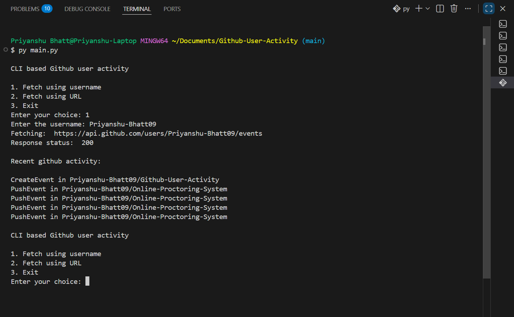

# Github User Activity CLI

A simple Python command-line tool to fetch and display recent public activity for any Github user.

**Project URL:** - https://roadmap.sh/projects/github-user-activity

## Features
- Fetch recent Github activity by username or direct API URL
- Shows the latest 5 events (public activity)
- Simple, interactive CLI

## Requirements
- Python 3.x (recommended 3.7 or above)
- Internet connection

## How to Run

1. **Open a terminal** and navigate to the project folder:
   
	

2. **Run the script:**
   
	```sh
	python main.py
	```

3. **Follow the on-screen menu:**
	- Enter `1` to fetch activity by Github username
	- Enter `2` to fetch activity by direct API URL
	- Enter `3` to exit

## Example Usage
```
CLI based Github user activity
1. Fetch using username
2. Fetch using URL
3. Exit
Enter your choice: 1
Enter the username: octocat
Recent github activity:
PushEvent in octocat/Hello-World
...
```

## Notes
- This tool uses the public Github API and may be rate-limited for unauthenticated requests.
- For any issues, check your internet connection or try again later.
